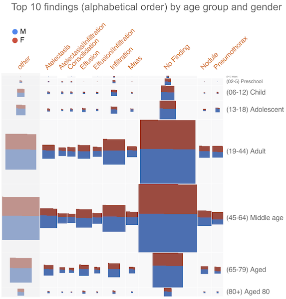

# Google Facets

If you haven't done so yet, review the details of [dataset we are using](../dataset.md).

[Google Facets](https://pair-code.github.io/facets/) was created to explore data with machine
learning in mind. It requires no coding, just loading the dataset.

It has two visualization modes (quotes from its website):

- [Overview](https://github.com/PAIR-code/facets#facets-overview): _quick understanding of the
  distribution of values across the features of their dataset(s). Uncover several uncommon and
  common issues such as unexpected feature values, missing feature values for a large number of
  observation, training/serving skew and train/test/validation set skew._
- [Dive](https://github.com/PAIR-code/facets#facets-dive): _an interactive interface for exploring
  the relationship between data points across all of the different features of a dataset. Each
  individual item in the visualization represents a data point. Position items by "faceting" or
  bucketing them in multiple dimensions by their feature values._

Note the disclaimer that this is not a Google product. It was developed and released as part of
their work [PAIR (people + AI research)](https://pair.withgoogle.com/) with the machine learning
community.

_Facets Dive_ allows us to explore multiple dimensions of a dataset at the same time. For example,
the picture below shows the distribution of the top ten diseases in the dataset by age group and
gender.

To get this picture, we set the following parameters in the visualization:

- Binning | X-Axis: Finding Labels
- Binning | Y-Axis: Patient Age Group
- Color By: Patient Gender

[How to explore the visualizations](../README.md#if-you-want-to-explore-the-visualizations).
