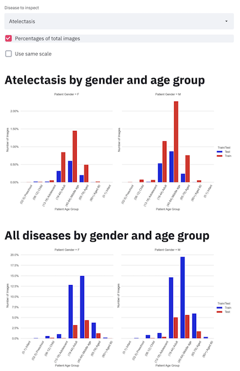

# Streamlit

If you haven't done so yet, review the details of [dataset we are using](../dataset.md).

[Streamlit](https://www.streamlit.io/) does more than visualization. It can also run models. We will
concentrate on the visualization part here.

Unlike [Google Facets](../google-facets/google-facets.md), it requires coding. On the other hand, it
is more powerful and flexible.

For example, we can add more specific filters and transformations. In the example developed here, we
can select a specific disease and show it in percentages of the total images.

[How to explore the visualizations](../README.md#if-you-want-to-explore-the-visualizations).
